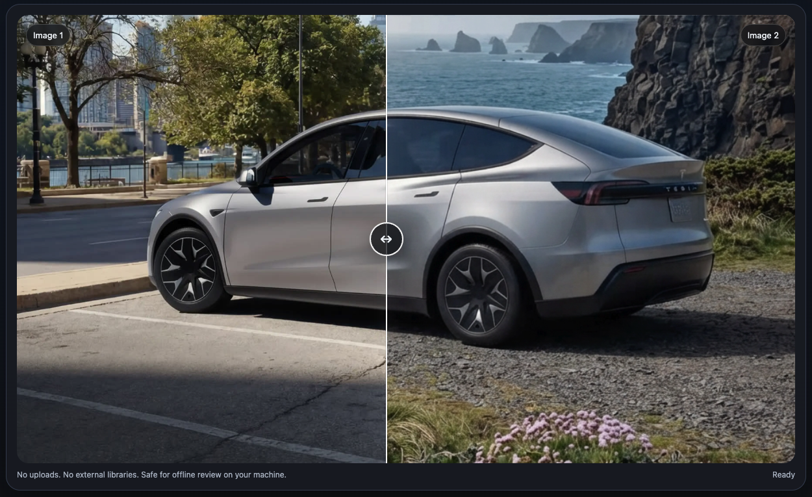

# image-compare-slider
Compare images locally in a browser using a slider.

## What is it for?

A light weight image comparison tool that runs in your browser. Use the slider to compare 2 images. e.g. reference image and modified image to visually identify differences. 

## Screenshots

  

## Features

- Slider to compare 2 images
- Zoom in & out
- X and Y axis offset
